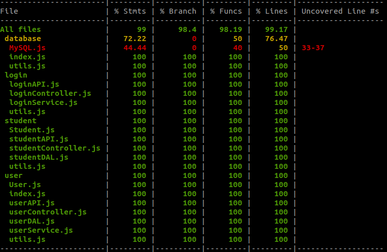

## Tecnologias
#### Database
- mysql

#### Back-end
- node
- bcrypt
- body-parser
- config
- cors
- cpf-check
- express
- joi
- jsonwebtoken
- mysql
- chai
- eslint-plugin-mocha
- eslint-plugin-security
- mocha
- nyc
- sinon
- supertest

#### Front-end
- node
- axios
- vue-router
- vuetify
- vuex
- eslint

## Arquitetura
O sistema foi dividido em 3 docker containers: database, backend e frontend. A comunicação destes containers funciona através da rede interna criada pelo Docker

## Build
Para facilitar a buid, todos os aquivos necessários já se encontram no repositório clonado, basta apenas seguir os passos do deploy

## Testes
Foram criado teste unitários apenas para o back-end. Os quais contemplam 98% da aplicação segundo o modulo NYC. Para a execução dos testes é necessário posuir o Node instalado e executar os sequintes comandos do diretório /backend
```shell
npm install
npm run coverage
```

O resultado deve ser similar ao abaixo:



## Deploy
Para o teste da aplicação e a criação dos containers basta possuir o Docker e o Docker Compose e então executar o seguinte comando da raiz do diretório /challenge-full-stack-web
```shell
docker-compose up
```
E então acessar http://localhost/
## Melhorias
No back-end eu senti a falta de um sistema de logger que me ajudasse a debugar a ferramenta em conjunto com o docker. Uma padroniação melhor nas respostas da requisições de erros e o teste unitário da classe MySQL que não consegui criar.

Acredito que no front-end eu poderia ter separado melhor os commits assim como melhor os descritos. Outras duas coisas que poderiam ter sido melhores foi a organização do diretório e os testes unitários que não foram feitos.

## Requisitos
Todos os requisitos foram entregues. Alguns com algumas alterações simples que não impactam de maneira direta.